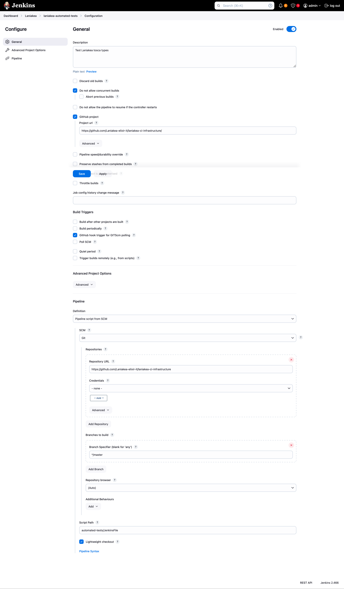

Automated Tests
===============

In order to ensure Laniakea's users requests result in successful deployments, we continuosly test our applications, using Jenkins.

The test module exploits `Orchent <https://github.com/indigo-dc/orchent>`_, a CLI utility which performs deployments from the command line with Laniakea, without the dashboard.

Therefore Orchent is a prerequisite, and its `installation <https://github.com/indigo-dc/orchent?tab=readme-ov-file#install-package-on-linux>`_ is mandatory.

The `Automated tests module <https://github.com/Laniakea-elixir-it/laniakea-ci-infrastructure/tree/master/automated-tests>`_ encompasses:

#. a `YAML file <https://raw.githubusercontent.com/Laniakea-elixir-it/laniakea-ci-infrastructure/master/automated-tests/laniakea_recas_prod.yaml>`_ listing the tests to run and the corresponding inputs.

#. an additional `YAML file <https://raw.githubusercontent.com/Laniakea-elixir-it/laniakea-ci-infrastructure/master/automated-tests/laniakea_dev_test_mapper.yaml>`_ with info for additional tests on Galaxy;

#. a `python <https://raw.githubusercontent.com/Laniakea-elixir-it/laniakea-ci-infrastructure/master/automated-tests/control-script.py>`_ with its modules, that parses the YAML file and performs the tests;

#. a `JenkinsFile <https://raw.githubusercontent.com/Laniakea-elixir-it/laniakea-ci-infrastructure/master/automated-tests/JenkinsFile>`_ for jenkins integration;

This module retrieve a valid token using `OIDC agent <https://github.com/indigo-dc/oidc-agent>`_, and, tests all tosca templates <https://github.com/Laniakea-elixir-it/tosca-templates>`_  used in Laniaka.

.. note::

   This module requires the authentication on OpenStack, therefore `OIDC Agent <https://github.com/indigo-dc/oidc-agent>`_ needs to be properly configured on jenkins nodes.

The test list
-------------

Tests are listed in the `YAML file <https://raw.githubusercontent.com/Laniakea-elixir-it/laniakea-ci-infrastructure/master/automated-tests/laniakea_recas_prod.yaml>`_, which includes all parameters to make a deployment using the orchent CLI.

Orchent takes few parameters for a deployment: the orchestrator url, a valid OIDC Token, the user group on IAM, the TOSCA template and the user inputs. All these parameters need to be passed to the python script to render the orchent call.

------------------
`orchestrator_url`
------------------

The orchestrator url is needed to perform the deployment.

-----------
`iam_group`
-----------

Add user to access the deployment if needed.

.. warning::

   Do not change, this should match the tosca template.

::

  test_user:
    os_user_name: "testuser"
    os_user_guid: "8001"
    os_user_add_to_sudoers: true
    os_user_ssh_public_key: < YOUR SSH PUBLIC KEY>

------
`test`
------

In this section are listed all tests that are performed. In the following we feature a galaxy deployment test.

::

  test:

    galaxy:
        name: "galaxy-minimal"
        enabled: no
        run_more: ['endpoint', 'ftp','galaxy_tools_FQC','galaxy_tools_mapping','screenshot']
        delete: always # always, no, on_success, on_error # TODO add the possibility to not delete the deployment.
        tosca_template: "https://raw.githubusercontent.com/Laniakea-elixir-it/laniakea-dashboard-config/laniakea-v3.0.0/tosca-templates/galaxy.yaml"
        tosca_template_path: "/tmp/laniakea_dev/galaxy.yml"
        inputs:
            instance_flavor: "large"
            storage_size: "50 GB"
            os_distribution: "centos"
            os_version: "7"
            version: "release_21.09"
            admin_api_key: not_very_secret_api_key
            users: []
            instance_description: "Galaxy Live"

**name**: the name of the deployment

**enabled**: if the test has to be performed

**run_more** do additional tests and not only the endpoint check. By default the module check only the status of the deployment: if it is ``CREATE_COMPLETE`` the test is successful.
Furthermore, it is possible to perform some additional test:

- endpoint availability through curl (all deployments);

- get a screenshot of the available service and see it by mail (all deployments);  
  
- workflow on galaxy to check tools installation and run (only for Galaxy).

The last two test are managed through the additional `YAML file <https://raw.githubusercontent.com/Laniakea-elixir-it/laniakea-ci-infrastructure/master/automated-tests/laniakea_dev_test_mapper.yaml>`_ (see next section).

**tosca_template**: The url of the tosca template to test.

**tosca_template_path**: The destination path of the downloaded tosca template.

**inputs**: The inputf of the tosca template.

Additional test
^^^^^^^^^^^^^^^

The additional test for Galaxy are described in the mapper `YAML file <https://raw.githubusercontent.com/Laniakea-elixir-it/laniakea-ci-infrastructure/master/automated-tests/laniakea_dev_test_mapper.yaml>`_

This file maps to each test its variables. To add a test, add it under 'test' and specify its variables. The test function to be executed must then be added with the same name specified here in the Tests.py module. Tests that run galaxy workflows using the bioblend script must start with 'galaxy_tools'.

::

  test:
      endpoint:
        #ftp:
        #file_path: testing/ftp_files/input_mate1.fastq
        #user: admin@admin.com
        #password: galaxy_admin_password
      galaxy_tools_FQC:
          wf_file: automated-tests/bioblend_test/workflows/test_workflow.ga
          input_file: automated-tests/bioblend_test/inputs/input_files.json
            #galaxy_tools_mapping:
            #    wf_file: automated-tests/bioblend_test/workflows/bowtie2_mapping.ga
            #    input_file: automated-tests/bioblend_test/inputs/input_files.json
      screenshot:
          geckodriver_path: ./geckodriver
          username: admin@admin.com
          password: galaxy_admin_password
          output_path: ./automated-tests/galaxy_screenshot.png

.. note::

   FTP tests are currently deprecated.

The Python control script
-------------------------

The `python <https://raw.githubusercontent.com/Laniakea-elixir-it/laniakea-ci-infrastructure/master/automated-tests/control-script.py>`_ is responsible for deployments management.

It parses the test list, and performa the deployment using orchent, for each test. It also takes as input the ``health-check.sh`` which performs test on the Orchestratr, to check its availability.

::

  python $PWD/automated-tests/control-script.py -c "$PWD/automated-tests/health-check.sh" -l ./automated-tests/laniakea_recas_prod.yaml

To use this script you need a valid IAM token.

.. note::

   Please check the `README file <https://github.com/Laniakea-elixir-it/laniakea-ci-infrastructure/tree/master/automated-tests#laniakea-ci-testing-module>`_ on GitHub for additional info.

Integration with Jenkins
------------------------

A `JenkinsFile <https://raw.githubusercontent.com/Laniakea-elixir-it/laniakea-ci-infrastructure/master/automated-tests/JenkinsFile>`_ is included in the cloud image repository. To use it, you just need to create a new pipeline and link it a JenkinsFile.

