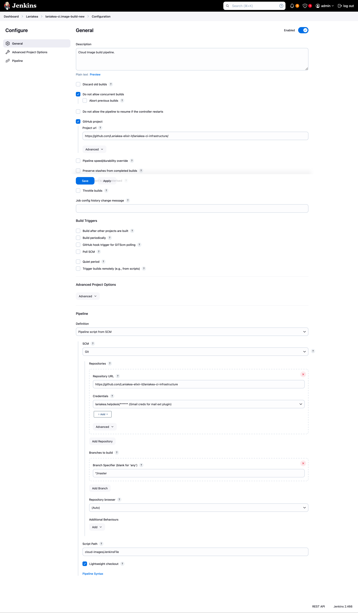

Cloud Images Creation
=====================

Laniakea exploits Cloud images for Express builds, i.e. the deployment of application which are pre-installed on a cloid images, and just reconfigured and started at deployment time.

These images needs to be rebuilt every time a new software release or update is delivered, and, of course, in case of critical security issues. Therefore, in the long run, their manual creation was not a sustainable strategy.

We use `Hashicorp Packer <https://developer.hashicorp.com/packer>`_ to create images, whith OpenStack plugin, to instantiate the VM on openstack cloud and save it automatically on it, and Ansible for software installation and configuration. Packer will create a VM on OpenStack, will use ansible to configure the software on it (same role used by Laniakea Live builds), and, once finished, will save the image on Glance, ready to be used. 

Therefore Packer is a prerequisite, and its `installation <https://developer.hashicorp.com/packer/tutorials/docker-get-started/get-started-install-cli>`_ is mandatory.

Finally, the image can be shared with all Laniakea tenants.

The `Cloud image module <https://github.com/Laniakea-elixir-it/laniakea-ci-infrastructure/tree/master/cloud-images>`_ encompasses:

#. a `YAML file <https://raw.githubusercontent.com/Laniakea-elixir-it/laniakea-ci-infrastructure/master/cloud-images/images_list.yaml>`_ listing the image to create and Ansible inputs.

#. a `python <https://raw.githubusercontent.com/Laniakea-elixir-it/laniakea-ci-infrastructure/master/cloud-images/build_images.py>`_ script for creating the image with Packer, which build the Packer json file and run it;

#. the Ansible playbooks and corresponding variables for application installation, i.e. Galaxy, RStudio, Jupyther and more.

#. a `JenkinsFile <https://raw.githubusercontent.com/Laniakea-elixir-it/laniakea-ci-infrastructure/master/cloud-images/JenkinsFile>`_ for jenkins integration;

.. note::

   This module requires the authentication on OpenStack, therefore `OIDC Agent <https://github.com/indigo-dc/oidc-agent>`_ needs to be properly configured on jenkins nodes.

The image list
--------------

The list of the cloud images that need to be created is hosted on `GitHub <https://github.com/Laniakea-elixir-it/laniakea-ci-infrastructure/tree/master/cloud-images>`_ as a YAML file.

-----------------
``images_db_url``
-----------------

Every time a new image is created, it is stored on CMDB. To prevent the re-build of images alrady created we check, before image building if the image is already on CMDB. If yes it is skipped.

----------
``images``
----------

In the section ``images`` we describe the image to create. For each image that has to be created, a new section needs to be added.

In the following, we report the example of the creation of a  galaxy cloud image:

::

      galaxy-express:
        name: "<IMAGE NAME>" <--------
        version: <vX.Y.Z> <--------
        build: no
        packer:
            ssh_username: rocky <--------
            source_image: "<IMAGE ID>" <--------
            flavor: large  <--------
            volume_size: "10"  <--------
            network_id: "<NETWORK ID>" <--------
            playbook_file: "galaxy.yml" <--------
            ansible_galaxy_file: "galaxy.yml" <--------

**name**: The name of the cloud image

**version**: The version of the cloud image in the form vX.Y.Z, e.g. v1.0.0

**build**: a boolean to enable image building. If yes the image is built, if no, it is not.

**ssh_username**: the user Ansible will use to access the created VM (default: rocky).

**source_image**: the soruce image ID on OpenStack to use.

**flavor**: the flavor of the VM to use on OpenStack (default:large).

**volume_size:** the size of the volume used for the VM (default: "10" GB).

**network_id**: the network ID to be attached to the VM

**playbook_file**: Ansible playbook which will be run by Ansible, e.g. galaxy.yml. Available playbooks are stored in the `playbook directory <https://github.com/Laniakea-elixir-it/laniakea-ci-infrastructure/tree/master/cloud-images/playbooks>`_.

**ansible_galaxy_file**: the requiremets file which will be used by **Ansible Galaxy** to install roles. All requirements file are in the `requiremets directory <https://github.com/Laniakea-elixir-it/laniakea-ci-infrastructure/tree/master/cloud-images/requirements>`_.

Image creation with Packer
--------------------------

Once the image list file is filled, the build is triggered through a `python script <https://raw.githubusercontent.com/Laniakea-elixir-it/laniakea-ci-infrastructure/master/cloud-images/build_images.py>`_. 

To test the script, you need to login on OpenStack using the tenant RC file. It can be done using Keystone credentials (username and password) or a Keystone token.

If you are going to use a valid OIDC token, you need to exchange it with a Keystone token, and export it as ``OS_TOKEN``. For example:

::

  export OS_TOKEN=$(openstack --os-auth-type v3oidcaccesstoken --os-access-token ${OIDC_ACCESS_TOKEN} token issue  -f json | jq -r ".id")

Create a new python virutal environment:

::

  python3 -m venv build

Activate it:

::

  . build/bin/activate

Install requirements:

::

  pip install -r ./cloud-images/requirements.txt
  
Finally you can run the script:

::

  python3 build_images.py

Integration with Jenkins
------------------------

A `JenkinsFile <https://raw.githubusercontent.com/Laniakea-elixir-it/laniakea-ci-infrastructure/master/cloud-images/JenkinsFile>`_ is included in the cloud image repository. To use it, you just need to create a new pipeline and link it a JenkinsFile.

Managing images
---------------

Finally, the created images need to be shared among all OpenStack tenants that should exploit them, and stored on CMDB.

In the `share <https://github.com/Laniakea-elixir-it/laniakea-ci-infrastructure/tree/master/cloud-images/share>`_ directory we have a script and a YAML file.

The YAML file is just the list of the tenants where the image has to be shared and few others Openstack parameters.

The `python script <https://raw.githubusercontent.com/Laniakea-elixir-it/laniakea-ci-infrastructure/master/cloud-images/share/share_laniakea_cloud_images.py>`_ share the image with these tenants. It just needs as inputs the OIDC token to access the tenants, the list, and the image ID.

::

  python3 share_laniakea_cloud_images.py -t $IAM_ACCESS_TOKEN -l laniakea_tenant_list.yml --i 3c4de00e-02a0-404c-877e-126c5a0f0a10

The script perform the following operations:

#. change image visibility to shared;
   
#. set the right image tags for CIP imports
   
#. add image to destinations tenants

#. accept the new image for each tenant.

Resources
---------

Cloud Veneto image management: https://userguide.cloudveneto.it/en/latest/ManagingImages.html

