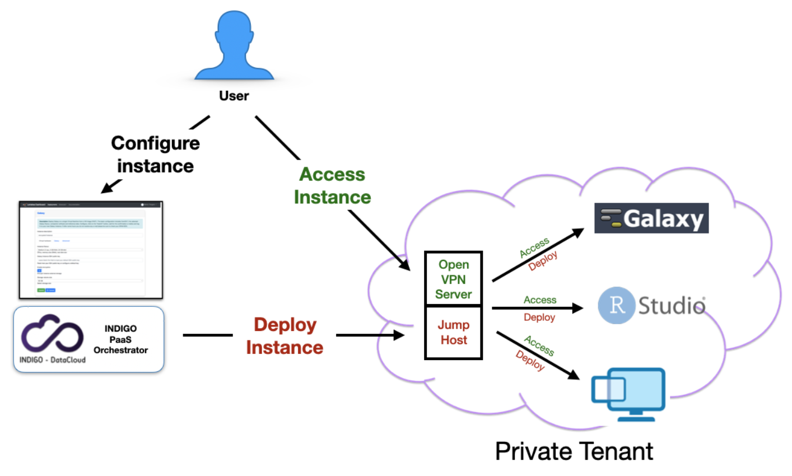

Deployment under VPN
====================

The PaaS provides the possibility to instantiate and configure VMs with private network only and then configure them to be accessed through a VPN, therefore providing complete isolation to the environment.

Isolation is reached using OpenStack tenant and security groups properties, granting the access only through VPN authentication, while the user authentication to the VPN using the same Laniakea credentials.

We use a jump host VM that has two fundamental functions: (1) allow IM to access the private network and perform VM installation and configuration; (2) allow users to access the private network and the deployment. Therefore, we need to configure it to act as access point to the IM and to the users.

.. note::

   The procedure has been tested only using Ubuntu 22.04 as OS on the jump host VM.

The VPN is based on OpenVPN, with clients and server are configured to use TPC protocol.

We exploit a PAM plugin to enable authentication through OpenID Connect, exploiting Oauth2 device flow:

#. the user connects to the VPN server using an OpenVPN client;

#. PAM is configured to send verification code by e-mail to the user;

#. the user can authenticate with its own Laniakea credentials;

#. the OIDC provider (INDIGO-IAM) sends the access token to the VPN server, that is now able to verify users identity and authorizations;

#. if the user owns the right tenant permissions, he is granted access to the private network and can finally interact with the deployed application.

.. figure:: _static/vpn/vpn_auth_flow.png
   :scale: 40%
   :align: center

VM configuration
----------------

Create VM for the jump host, in the tenant where you want enable the VPN deployments. You need a jump host for each tenant.

The VM should meet the following minimum requirements:

======= ==============================
OS      Ubuntu 22.04
vCPUs   2
RAM     4 GB
Network Public and private IP address.
======= ==============================

PAM module installation and configuration
-----------------------------------------

Original instructions provided here: https://github.com/maricaantonacci/pam_oauth2_device#readme

Device code timeout is default is 0. It should be a different value: we set 300.

OpenVPN installation
--------------------

.. note::

   OpenVPN version >= 2.5 is needed for the server in order to enable the deferred authentication mechanism.

The first step is install OpenVPN

::

  wet -O - https://swupdate.openvpn.net/repos/repo-public.gpg | sudo apt-key add -

  echo "deb [arch=amd64 signed-by=/etc/apt/keyrings/openvpn-repo-public.gpg] https://build.openvpn.net/debian/openvpn/release/2.5 jammy main" > /etc/apt/sources.list.d/openvpn-aptrepo.list

  sudo apt update

You can install OpenVPN with the `script <https://raw.githubusercontent.com/Nyr/openvpn-install/master/openvpn-install.sh>`_

.. note::

   Please select the following options: TCP for protocol

::

  wget https://raw.githubusercontent.com/Nyr/openvpn-install/master/openvpn-install.sh

  chmod +x openvpn-install.sh

  ./openvpn-install.sh

Enable the PAM plugin
---------------------

Create the file ``/etc/pam.d/openvpn`` with your favourit editor:

::

  auth required pam_oauth2_device.so
  account sufficient pam_oauth2_device.so

Then edit /etc/openvpn/server/server.conf adding the Public ip of the jump host and the private network IP.

.. note::

   Moreover, lines 26-31 are needed to be properly configured for the pam oauth2 module.

::

  local <PUBLIC IP OF THE JUMP HOST>
  port 1194
  proto tcp
  dev tun
  ca ca.crt
  cert server.crt
  key server.key
  dh dh.pem
  auth SHA512
  tls-crypt tc.key
  topology subnet
  server 10.8.0.0 255.255.255.0
  #push "redirect-gateway def1 bypass-dhcp"
  push "route <PRIVATE NETWORK> 255.255.255.0"
  ifconfig-pool-persist ipp.txt
  push "dhcp-option DNS 8.8.8.8"
  push "dhcp-option DNS 8.8.4.4"
  keepalive 10 120
  cipher AES-256-CBC
  user nobody
  group nogroup
  persist-key
  persist-tun
  verb 7
  crl-verify crl.pem
  plugin /usr/lib/x86_64-linux-gnu/openvpn/plugins/openvpn-plugin-auth-pam.so openvpn
  duplicate-cn
  setenv deferred_auth_pam 1
  reneg-sec 0
  hand-window 300
  username-as-common-name

In particular:

#. ``duplicate-cn``: Allow multiple clients with the same common name to concurrently connect. In the absence of this option, OpenVPN will disconnect a client instance upon connection of a new client having the same common name.

#. ``setenv deferred_auth_pam 1``: enable deferred auth method.

#. ``reneg-sec 0``: avoid the end user to be challenged to reauthorize once per hour (default value).

#. ``hand-window 300``: set the handshake window to a larger value (default is 60s) to copy with email delays.

#. ``username-as-common-name``: use the authenticated username as the common name, rather than the common name from the client cert (neededas we are using the auth-user-pass on the client side).

Edit the client.ovpn file, with public IP of the jump ost and adding the needed options (lines 15-17):

::

  client
  dev tun
  proto tcp
  remote <PUBLIC IP OF THE JUMP HOST> 1194
  resolv-retry infinite
  nobind
  persist-key
  persist-tun
  remote-cert-tls server
  auth SHA512
  cipher AES-256-CBC
  ignore-unknown-option block-outside-dns
  block-outside-dns
  verb 3
  auth-user-pass
  reneg-sec 0
  hand-window 300
  <ca>
  ...
  </ca>

Finally, restart the server:

::

  systemctl restart openvpn-server@server.service

Jump host connection tweaks
===========================

https://askubuntu.com/questions/1181115/openvpn-client-cannot-access-any-network-except-for-the-server-itself-after-conn

aggiungo il masquarade

iptables -t nat -A POSTROUTING -s 10.8.0.0/24 -d 172.18.7.0/24 -o ens4 -j MASQUERADE

rimuovo SNAT

iptables -t nat -D POSTROUTING 1

mettere ip_forwarding 1

PaaS Configuration
------------------
