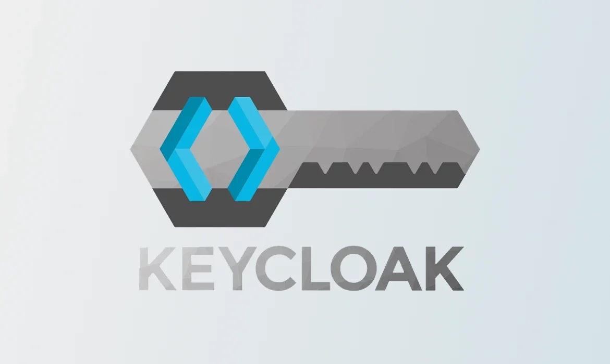

Keycloak
========

Keycloak is an easy open source identity and access management solution, it adds single-sign-on and authentication to applications and secure services with minimum and simple configurations. Keycloak is an Identity Access Management(IAM) solution which manages a user database (name, email, password, role, ...) and authenticates them to the final application/s. It also supports standard like OpenID Connect (OIDC) and SAML 2.0.

We provide a complete guide from the installation, protracted in this section, and configuration, described in the Laniakea-Nebula VPN section :ref:`here <connection_keycloak_configuration>`.

.. note::
   If you already have a running Keycloak go to :ref:`this section <connection_keycloak_configuration>` to configure realms and eduperson management. Otherwise follow these steps to obtain a fully running Keycloak.
   It is important to note that this guide presents a `Docker Compose project <https://github.com/riccardocaccia/docker-compose-keycloak-caddy-posgredb>`_, which contains Keycloak, PostgreSQL as its database, and Caddy to manage HTTPS automatically.

Keycloak Deployment with Caddy & PostgreSQL
-------------------------------------------

This project provides a containerized Identity and Access Management (IAM) solution using Keycloak ``25.0.2``, proxied through Caddy for SSL termination, with PostgreSQL as the persistent storage.

The architecture is composed of:

1. **Keycloak**: Core IAM service running on Quarkus.
2. **Caddy**: Reverse proxy handling HTTPS and automatic SSL certificates.
3. **PostgreSQL**: Reliable relational database for Keycloak metadata and user data.

The main Features of this projects are:

* **Dockerized**: Entire stack managed via Docker Compose.
* **Automatic Security**: Caddy handles SSL/TLS certificates (Let's Encrypt) automatically.
* **Scalability**: Decoupled database and application layers.

Installation
~~~~~~~~~~~~
.. warning:
   The installation will need some prerequisites not covered in this tutorial:

   1. Docker and Docker Compose installed (`docker installation <https://docs.docker.com/engine/install/>`_, `docker compose installation <https://docs.docker.com/compose/install/>`_ ).
   2. A registered domain name (DSN) pointing to your server's IP (required for Caddy's automatic HTTPS).

To start with the deployment you need to follow these steps: 

.. code-block:: bash
   git clone https://github.com/riccardocaccia/docker-compose-keycloak-caddy-posgredb.git
   cd docker-compose-keycloak-caddy-posgredb

Then you can personalize various fields insiede the main ``docker-compose.yml`` file, BUT is a MUST to update the ``KC_HOSTNAME`` with your domain.

.. note::
   We strongly suggest changing the default passwords and usernames.

.. code-block:: yaml

   ...
     environment:
       POSTGRES_DB: keycloak
       POSTGRES_USER: keycloak
       POSTGRES_PASSWORD: CHANGE_HERE
   ...
   keycloak:
     ...
     environment:
       KC_DB: postgres
       KC_DB_URL: jdbc:postgresql://postgres:5432/keycloak
       KC_DB_USERNAME: keycloak
       KC_DB_PASSWORD: CHANGE_HERE
       KEYCLOAK_ADMIN: admin
       KEYCLOAK_ADMIN_PASSWORD: CHANGE_HERE
       KC_HOSTNAME: YOUR-DOMAIN.CHANGE_HERE.COM
       KC_PROXY: edge
       KC_HOSTNAME_STRICT_HTTPS: "true"
   ...
    
Then we can procede and start the stack:

.. code-block:: bash
   docker-compose up -d

Caddy will automatically fetch the SSL certificates for the domain specified in the configuration. You can now proceed to configure the IAM functionalities.

References
----------
* Keycloak: https://www.keycloak.org/
* Caddy Server: https://caddyserver.com/
