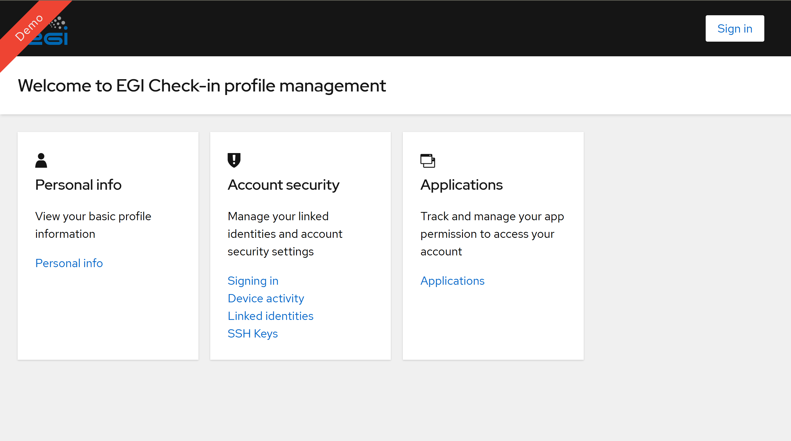
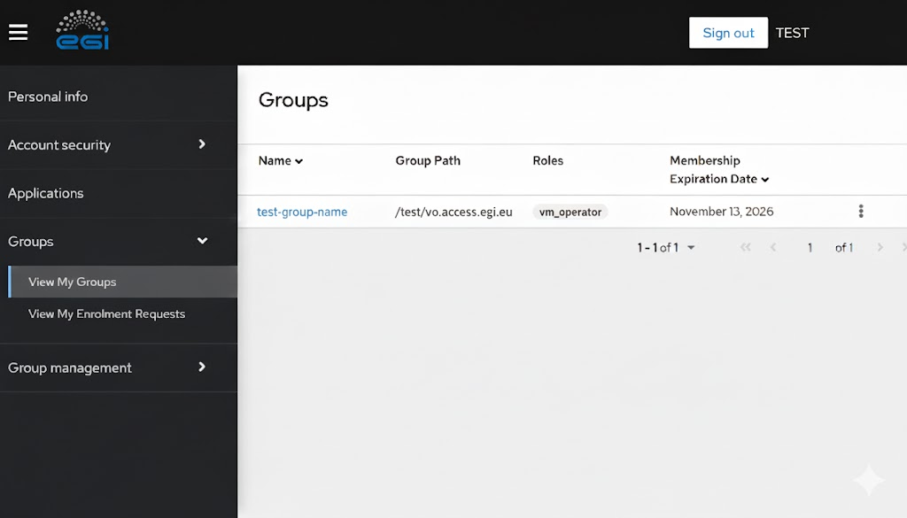
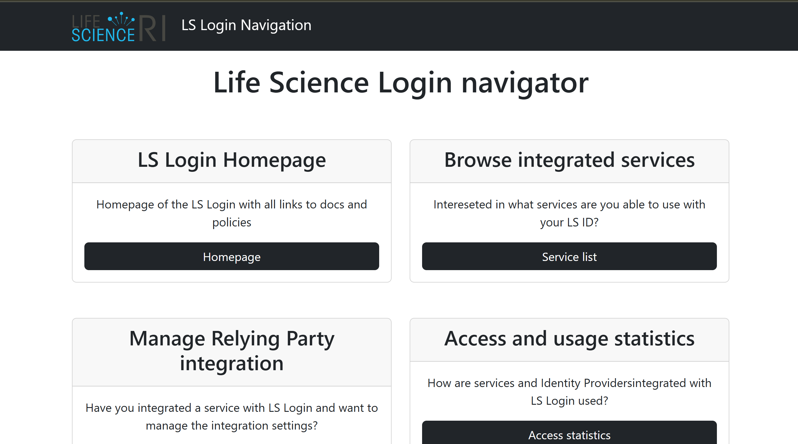
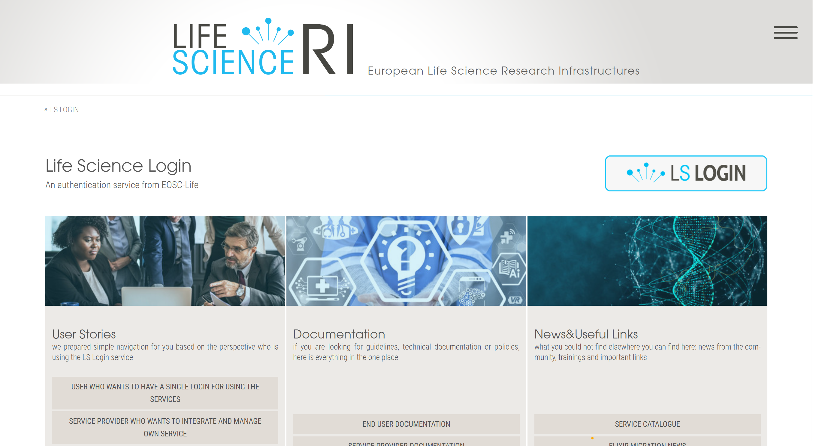
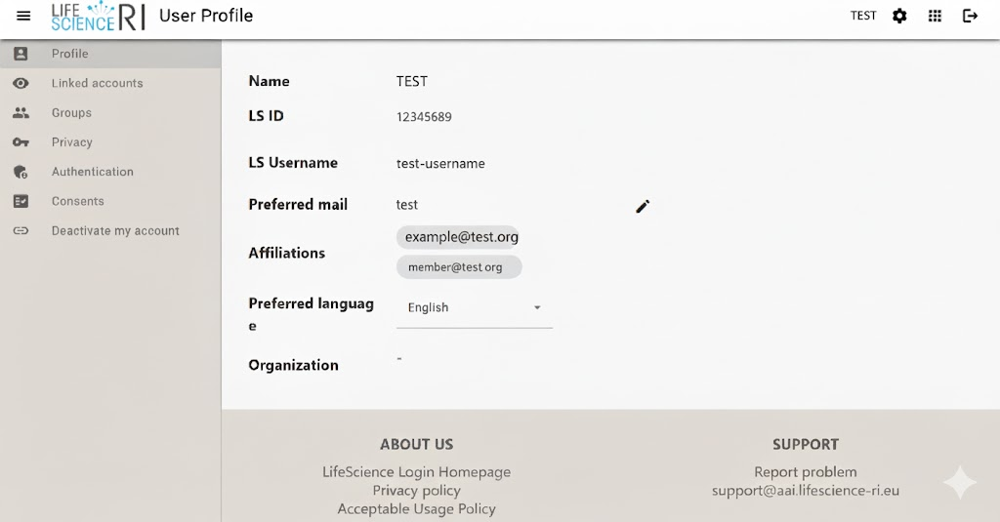
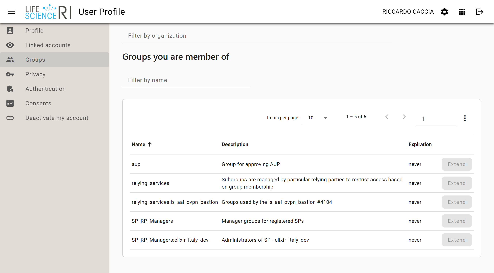

Applications deploy under VPN
=============================

Laniakea provides the possibility to deploy its applications as VPN isolated environments using just private networks.

Indeed the access is grant only through VPN authentication, using the same Laniakea credentials. 

Therefore only users authrised using the Laniakea authentication system can access the application server.

.. seealso::

   To login to the Laniakea dashboard visit the section: :doc:`/user_documentation//authentication/authentication`.

In the following tutorial we describe how to deploy Galaxy under a VPN and exploit it.

.. note::

   The step are identical for any other application on Laniakea.

Deploy an application under VPN
-------------------------------

To deploy and application under VPN select among those available:

.. figure:: img/vpn_deployment_select.png
   :scale: 40 %
   :align: center

The deployment will follow as usual. Once the Deployment is complete click on ``details`` button under **Action** section, and navigate to ``Output values``.

.. figure:: img/vpn_deployment_complete.png
   :scale: 20 %
   :align: center

.. figure:: img/vpn_deployment_output_values.png
   :scale: 30 %
   :align: center

Here if you click the Galaxy url, it is not possible to access it since it wouldn't be available.

.. figure:: img/vpn_deployment_galaxy_fail.png
   :scale: 20 %
   :align: center

To access it, save the ovpn file on your computer, please click on the ``Save Link As`` button and select ``Save Link As``.

.. figure:: img/vpn_deployment_save_ovpn_file.png
   :scale: 30 %
   :align: center

Two possibilities for accessing Galaxy is here explored:

#. ``OpenVPN Connect``
#. ``Tunnelblick`` (suggested for MacOS user)

OpenVPN Connect
~~~~~~~~~~~~~~~

To follow this tutorial is necessary that you install the official client application that enables to securely access network resources. We strongly suggest **OpenVPN Connect**, available on Windows, MacOS and Linux. The steps for OpenVPN Connect are shown below.

.. note::
   **OpenVPN Connect** is not the only valid client option, **Tunnelblick** can also be used on **MacOS** (but not on Windows).  
   However, it is essential to use a client that does **not** prompt for a password before authentication (Later in this guide, we will cover this topic in more detail),  
   so that the login verification code can be received by e-mail.

Please visit the `official OpenVPN CLient page <https://openvpn.net/client/>`_ to download the client.
Once you have installed and opened the client you should see the following window:

.. figure:: img/openvpn_connect_cloud_connection.png
   :scale: 30%
   :align: center

Here, at the bottom of the window, you need to upload  the **.ovpn** file previously created by your **Admin**, e.g the one called ``client.ovpn``.
Once you have uploaded the file, you will be redirected to the following page:

.. figure:: img/openvpn_ovpn_uploaded.png
   :scale: 30%
   :align: center

Now is sufficent to click connect and compile the following fields:

.. warning::
   **Important:** We use this client (**Tunnelblick** also supports this feature) because it allows the user to start the authentication process without requiring a real password.  
   When filling in the login fields, you can enter **any string** as the password , **it is not used for verification**.  
   The only mandatory field is your **e-mail address**, where the authentication code will be sent.  
   The password field cannot be left empty, but it can contain any value (e.g. ``aaaaaaa`` or ``password``) and can be changed freely at any login.

.. figure:: img/openvpn_login.png
   :scale: 30% 
   :align: center

When you first configure the connection in **OpenVPN Connect**, you may see the following prompt:

.. tip::
   .. figure:: img/openvpn_missing_certificate.png
      :scale: 40%
      :align: center

   This message appears when the client expects an external certificate for authentication.  
   In our **example**, this step is not required, so we had simply disabled the *“Require External Certificate”* option in the connection profile. (you may want to keep it)

   Once disabled, you can proceed with the configuration as shown below:

   .. figure:: img/openvpn_disable_certificate.png
      :scale: 50%
      :align: center

   Make sure to:  
     #. Disable the field: Require External Certificate
     #. Click **Save Changes** to receive the email

Tunnelblick
~~~~~~~~~~~

In this case we are showing also `tunnelblick <https://tunnelblick.net/>`_, which is available for OSX and Linux systems. Install Tunnelblick and import the ``OVPN file`` on your client.

.. figure:: img/vpn_deployment_ovpn_file_import.png
   :scale: 30 %
   :align: center

Type your e-mail, the one used to register on Laniakea.

.. warning::

   Only the e-mail is needed, not the passoword! Leave any other filed blank.

.. figure:: img/vpn_deployment_tunnelblick_creds.png
   :scale: 30 %
   :align: center

You will receive an e-mail with authentication url. Click on it ...

.. figure:: img/vpn_deployment_mail.png
   :scale: 30 %
   :align: center

... authenticate and authorize the client.

.. figure:: img/vpn_deployment_client_authorization.png
   :scale: 20 %
   :align: center

Finally, you'll see on tunnelblick that your VPN tunnel is working fine.

.. figure:: img/vpn_deployment_tunnelblick_ok.png
   :scale: 50 %
   :align: center

And you can access Galaxy.

.. figure:: img/vpn_deployment_galaxy_ok.png
   :scale: 20 %
   :align: center

Identity and Access Management (IAM)
------------------------------------

This section describes how to interact with and register for each of the primary Identity Providers and authorization systems. These systems enable users to verify their identity and demonstrate their access permissions. To start you have to posses a valid account to one of the following Authentication and Authorization Infrastructure (AAI):

* **EGI Check-in**: The main proxy service for EGI resources.
    * **EGI Production**: For real research activities and stable deployments. `Egi-production Link <https://aai.egi.eu/>`_
    * **EGI Demo**: A sandbox environment for tutorials and testing. `Egi-Demo Link <https://aai-demo.egi.eu/>`_
    * **EGI Dev**: Dedicated to developers for testing new features. `Egi-Dev Link <https://aai-dev.egi.eu/>`_
* **Life Science AAI (LS AAI)**: The authentication infrastructure dedicated to the Life Science community. `LS AAI Link <https://services.aai.lifescience-ri.eu/>`_
* **INDIGO IAM**: The Identity and Access Management service (e.g., RECAS instance) for fine-grained authorization.

.. warning::

   Here it is essential to coordinate with your **Admin** to manage authorization requests and ensure resource accessibility.

EGI Check-in
~~~~~~~~~~~~

`EGI Check-in <https://aai.egi.eu/>`_ is the main gateway to access the platform's distributed resources. It acts as a bridge between your institutional identity and the scientific services.

   *The EGI Check-in login page where you can select your Identity Provider.*

To ensure you have the correct permissions for VPN deployment, follow these steps:

1. **Login**: Access the portal and authenticate using your institutional account or the method provided by your administrator.
2. **Check the Environment**: 
   
   .. important::
      EGI operates different environments. Make sure you are logging into the correct one (**Production**, **Demo**, or **Dev**). Permissions granted in the *Demo* environment will not work in *Production*.

3. **Verify Group Membership**: Once logged in, navigate to the **"Groups"** section in your dashboard. Here you can see the list of Virtual Organizations (VOs) and subgroups you belong to.

   *Example of the Groups dashboard. Ensure that the 'Group Path' matches the one required for your VPN access.*

.. tip::
   If you don't see the expected group (e.g., ``/test-access-path``), please contact your **Admin**. Access to private VPN networks is strictly tied to these memberships; without the correct group assignment, the VPN authentication will fail.

Life-Science AAI
~~~~~~~~~~~~~~~~

Life-Science AAI is the authentication infrastructure tailored for the life sciences community. It allows you to use your existing institutional credentials to access shared resources.

1.  **Access the Portal**: Click the `LS AAI Link <https://services.aai.lifescience-ri.eu/>`_. To begin the login process, click the **LS Login** button located in the first quadrant of the homepage.

   *The LS AAI homepage: locate the login area to proceed.*

2.  **Identity Selection**: You will be redirected to the main login page. Click the **LS Login** button on the right side of the screen.

3.  **Institutional Login**: Select your home institution (university or research center) and follow the steps to authenticate using your official credentials.

   *then after this step you need to choose your provider to complete the authentication process.*

.. note::
   Once logged in, your profile informations need to be shared with the Laniakea platform to enable VPN access. If your institution is not listed, contact your **Admin** to discuss alternative login methods or new groups enrollment.

4. **Profile exploration**: Once you're inside, you'll see your profile information, like this:

   *Overview of the LS AAI profile homepage.*

5. **Group**: Now, check that you are part of the correct group.

   *Overview of a LS AAI group.*

.. note::
   Once logged in, your profile informations need to be shared with the Laniakea platform to enable VPN access. If your institution is not listed, contact your **Admin** to discuss alternative login methods or new groups enrollment.

Indigo IAM (recas)
~~~~~~~~~~~~~~~~~~

mmm

