Applications deploy under VPN
=============================

Laniakea provides the possibility to deploy its applications as VPN isolated environments using just private networks.

Indeed the access is grant only through VPN authentication, using the same Laniakea credentials. 

Therefore only users authrised using the Laniakea authentication system can access the application server.

.. seealso::

   To login to the Laniakea dashboard visit the section: :doc:`/user_documentation//authentication/authentication`.

In the following tutorial we describe how to deploy Galaxy under a VPN and exploit it.

.. note::

   The step are identical for any other application on Laniakea.

To deploy and application under VPN select among those available:

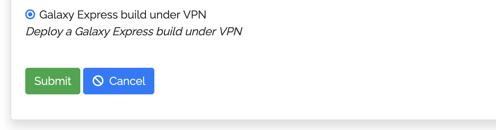

The deployment will follow as usual. Once the Deployment is complete click on ``details`` button under **Action** section, and navigate to ``Output values``.

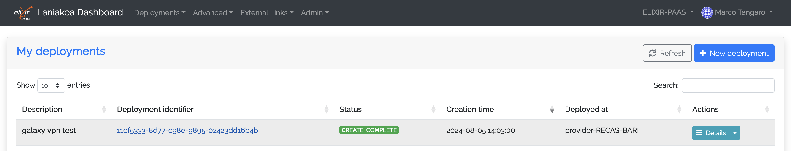

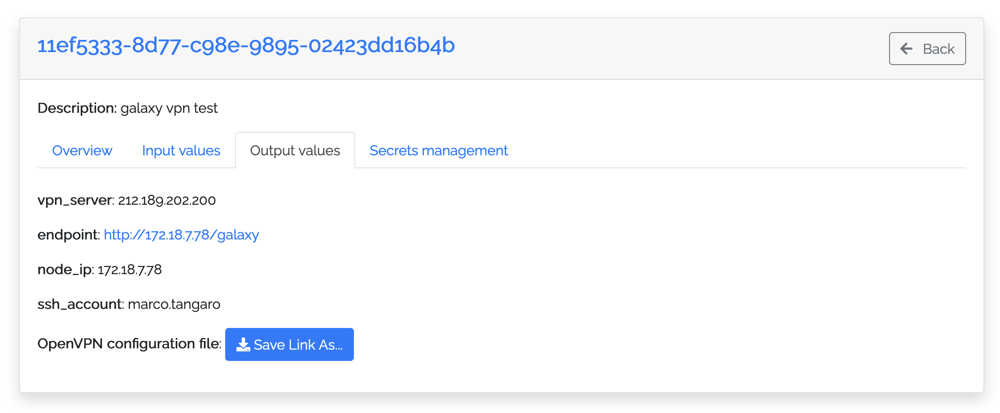

Here if you click the Galaxy url, it is not possible to access it since it wouldn't be available.

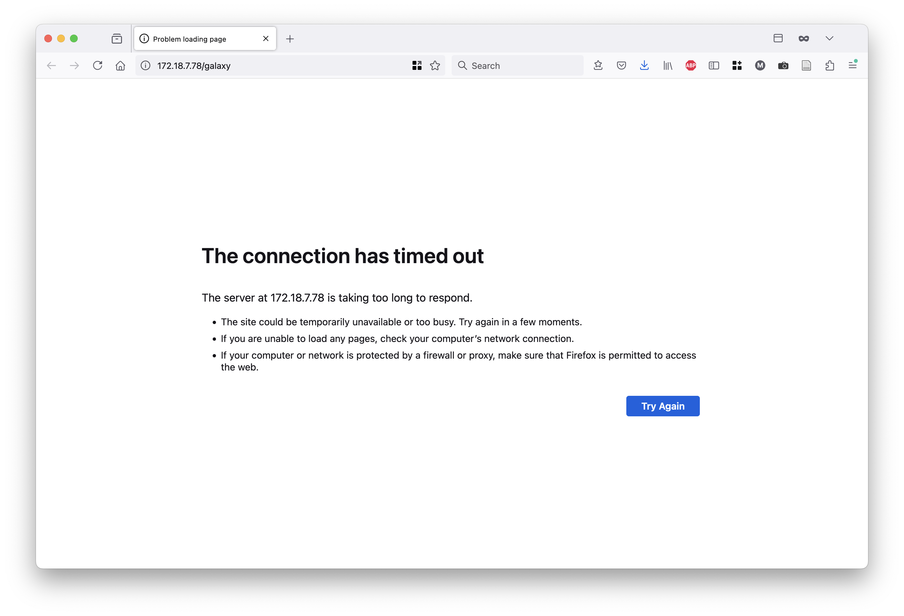

To access it, save the ovpn file on your computer, please click on the ``Save Link As`` button and select ``Save Link As``.

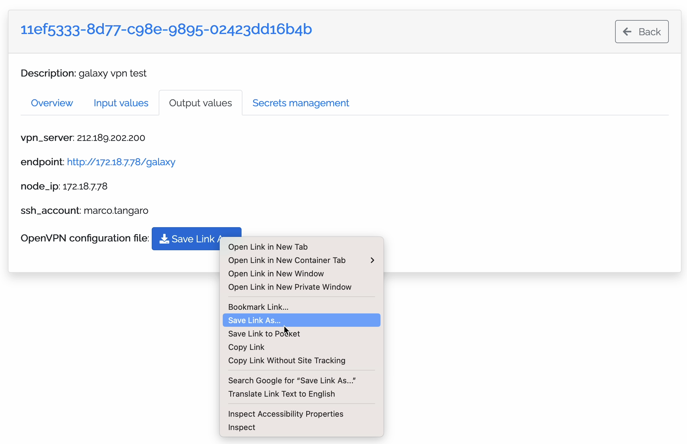

Two possibilities for accessing Galaxy is here explored:

#. ``OpenVPN Connect``
#. ``Tunnelblick`` (suggested for MacOS user)

OpenVPN Connect
~~~~~~~~~~~~~~~

To follow this tutorial is necessary that you install the official client application that enables to securely access network resources. We strongly suggest **OpenVPN Connect**, available on Windows, MacOS and Linux. The steps for OpenVPN Connect are shown below.

.. note::
   **OpenVPN Connect** is not the only valid client option, **Tunnelblick** can also be used on **MacOS** (but not on Windows).  
   However, it is essential to use a client that does **not** prompt for a password before authentication (Later in this guide, we will cover this topic in more detail),  
   so that the login verification code can be received by e-mail.

Please visit the `official OpenVPN CLient page <https://openvpn.net/client/>`_ to download the client.
Once you have installed and opened the client you should see the following window:

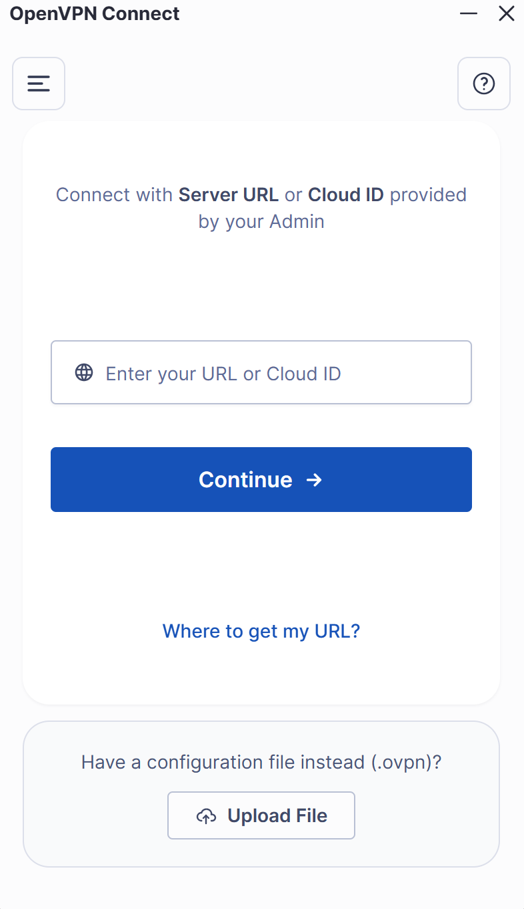

Here, at the bottom of the window, you need to upload  the **.ovpn** file previously created by your **Admin**, e.g the one called ``client.ovpn``.
Once you have uploaded the file, you will be redirected to the following page:

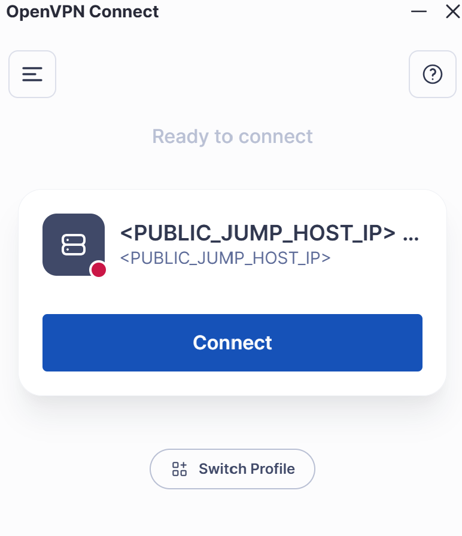

Now is sufficent to click connect and compile the following fields:

.. warning::
   **Important:** We use this client (**Tunnelblick** also supports this feature) because it allows the user to start the authentication process without requiring a real password.  
   When filling in the login fields, you can enter **any string** as the password , **it is not used for verification**.  
   The only mandatory field is your **e-mail address**, where the authentication code will be sent.  
   The password field cannot be left empty, but it can contain any value (e.g. ``aaaaaaa`` or ``password``) and can be changed freely at any login.

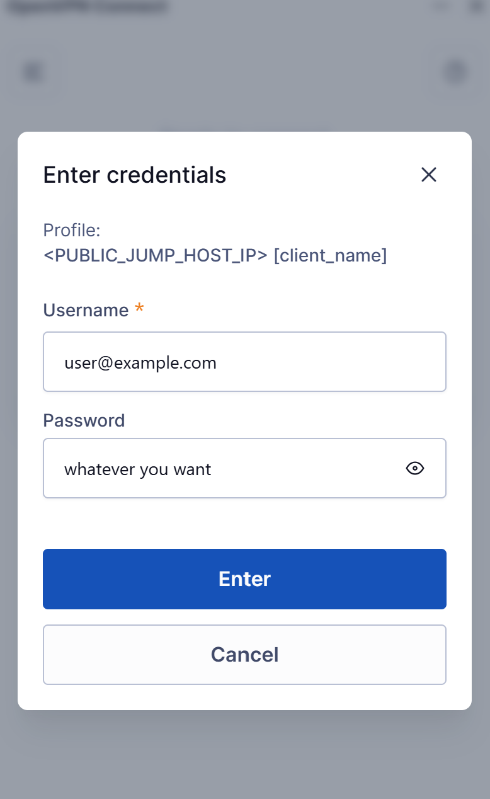

When you first configure the connection in **OpenVPN Connect**, you may see the following prompt:

.. tip::
   .. figure:: img/openvpn_missing_certificate.png
      :scale: 60%
      :align: center

   This message appears when the client expects an external certificate for authentication.  
   In our **example**, this step is not required, so we had simply disabled the *“Require External Certificate”* option in the connection profile. (you may want to keep it)

   Once disabled, you can proceed with the configuration as shown below:

   .. figure:: img/openvpn_disable_certificate.png
      :scale: 50%
      :align: center

   Make sure to:  
     #. Disable the field: Require External Certificate
     #. Click **Save Changes** to receive the email

Tunnelblick
~~~~~~~~~~~

In this case we are showing also `tunnelblick <https://tunnelblick.net/>`_, which is available for OSX and Linux systems. Install it and import the ``OVPN file`` on your client.

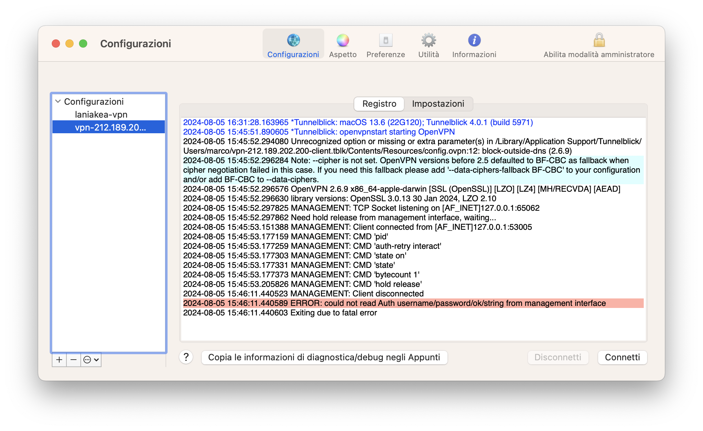

Type your e-mail, the one used to register on Laniakea.

.. warning::

   Only the e-mail is needed, not the passoword! Leave any other filed blank.

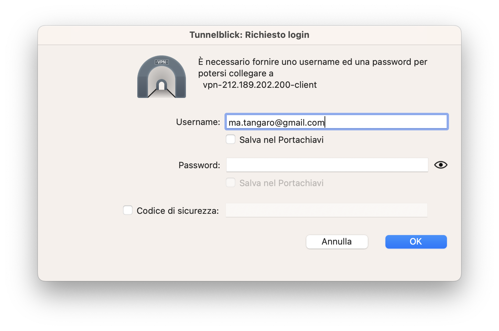

You will receive an e-mail with authentication url. Click on it ...

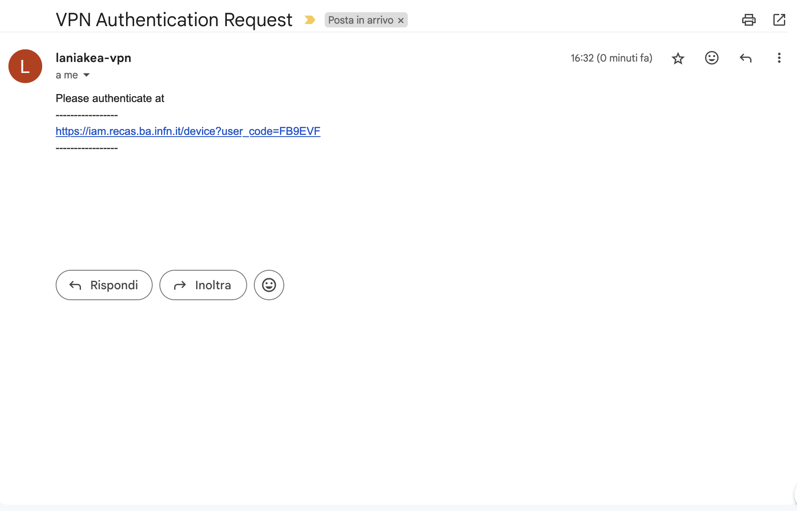

... authenticate and authorize the client.

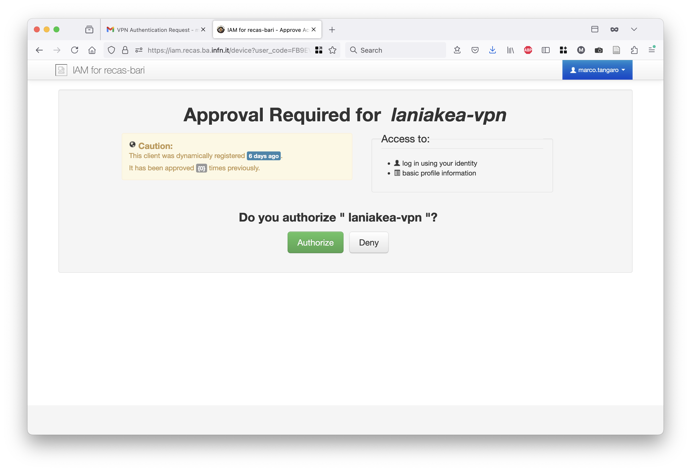

Finally, you'll see on tunnelblick that your VPN tunnel is working fine.

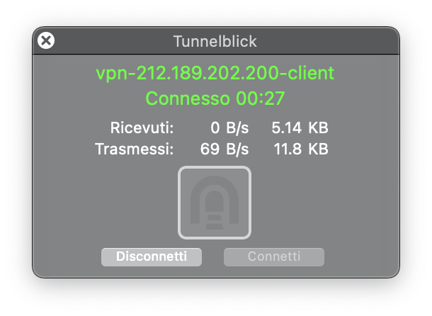

And you can access Galaxy.

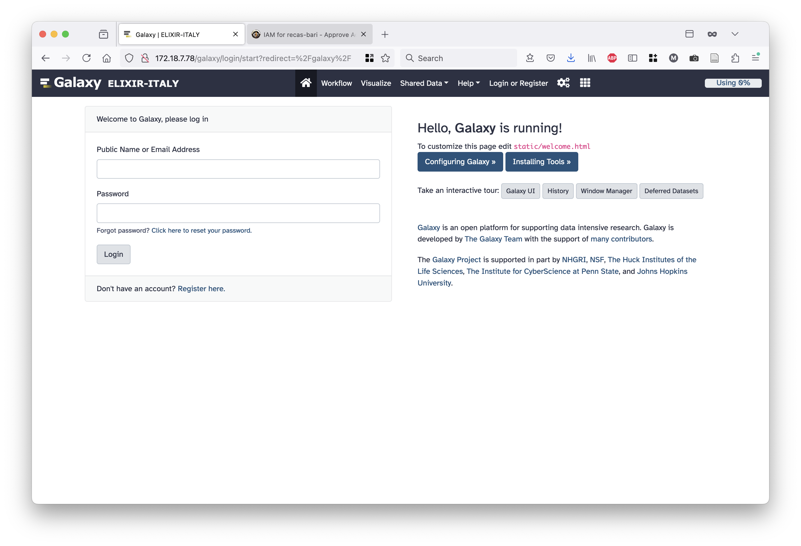
