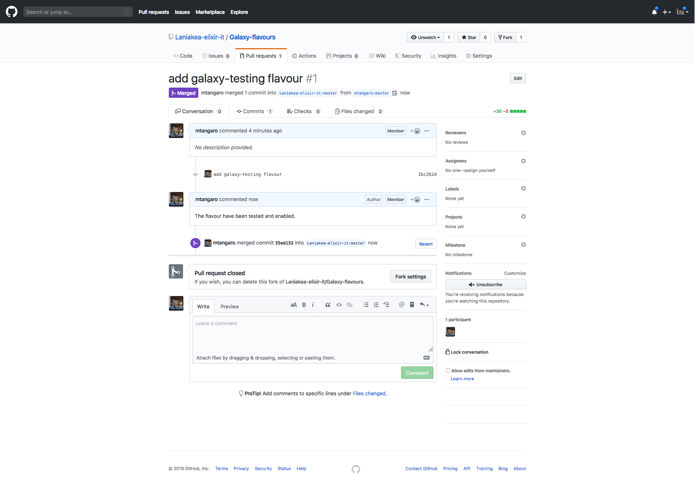

Create and test Galaxy flavours
===============================

New flavours can be easily added to Laniakea through a Pull Request on our `GitHub page <https://github.com/Laniakea-elixir-it/Galaxy-flavours>`_.

In this step will be described how to make a Pull Request to the Laniakea GitHub repository to create a new flaovur.

#. Fork the Laniakea GitHub `Galaxy flavours repository <https://github.com/Laniakea-elixir-it/Galaxy-flavours.git>`_.

#. Clone the forked repository:

   ::

     git clone https://github.com/<user-name>/Galaxy-flavours.git

#. Create a new directory with the name of your flavor. For example, ``galaxy-testing`` in this case.

   ::

     mkdir galaxy-testing

#. To create a new Galaxy flavour, a tool list file, written in YAML syntax, has to be provided. The ``examples`` directory provides some samples.

   Move in the flavour directory:

   ::

     cd galaxy-testing

   Edit your tool list file with your favourite text editor adding  the following default configuration lines:

   ::

     ---
     
     api_key: admin
     galaxy_instance: http://localhost:8080
     install_resolver_dependencies: true
     install_tool_dependencies: false

   Then, add your tool list. For each tool to install, ``name``, ``owner`` and ``tool_panel_section_label``, which labels the tools section in the right Galaxy panel, have to be provided:
   ::

     tools:

       - name: fastqc
         owner: devteam
         tool_panel_section_label: "tools"
       
       - name: bowtie2
         owner: devteam
         tool_panel_section_label: "tools"
       
       - name: bowtie_wrappers
         owner: devteam
         tool_panel_section_label: "tools"
       
       - name: sam_to_bam
         owner: devteam
         tool_panel_section_label: "tools"
       
       - name: bam_to_sam
         owner: devteam
         tool_panel_section_label: "tools"

   In this case the 

   .. figure:: img/galaxy-testing-flavour.png
      :scale: 70%
      :align: center

#. If you don't need to add one or more workflows to your flavor, move to the next step.

   Create a new directory in your flavour directory:

   ::

     mkdir workflow

   For example, in our galaxy-testing flavour we, currently, have:

   ::

     ~/Galaxy-flavours/galaxy-testing$ ls

     tool-list.yaml  workflow
 
   Navigate in this directory and copy here your Galaxy workflows with ``.ga`` extension.

#. We are now ready to create a Pull Request. Add your files to your GitHub repository. For example, for our testing flavour:

   ::

     cd galaxy-testing 

     $ git add tool-list.yaml workflow/Galaxy-Workflow-test.ga

     $ git commit -m "add galaxy-testing flavour"
     [master 2bc262d] add galaxy-testing flavour
      2 files changed, 30 insertions(+)
      create mode 100644 galaxy-testing/tool-list.yaml
      create mode 100644 galaxy-testing/workflow/Galaxy-Workflow-test.ga
     
     $ git push
     Username for 'https://github.com': mtangaro
     Password for 'https://mtangaro@github.com': 
     Counting objects: 3, done.
     Compressing objects: 100% (3/3), done.
     Writing objects: 100% (3/3), 356 bytes | 0 bytes/s, done.
     Total 3 (delta 1), reused 0 (delta 0)
     remote: Resolving deltas: 100% (1/1), completed with 1 local object.
     To https://github.com/mtangaro/Galaxy-flavours.git
        be92a03..2bc262d  master -> master

#. Finally, from GitHub it is possible to create a Pull Request to the Laniakea repository:

   .. figure:: img/galaxy-testing-PR.png
      :scale: 30%
      :align: center

We will review and test your flavour and enable it on Laniakea. 

These changes must be merged to the main branch of the `Galaxy flavours repository <https://github.com/Laniakea-elixir-it/Galaxy-flavours.git>`_. The merge will b

.. warning::

   To enable this changes on Laniakea requires at least 1 working day.

Tool list configuration options
-------------------------------  

====================================  =====================================  ====================================  ========================================
Keys                                  Required                               Default value                         Description
====================================  =====================================  ====================================  ========================================
``name``                              yes                             				                   This is is the name of the tool to install
``owner``                             yes                             				                   Owner of the Tool Shed repository from where the tools is being installed
``tool_panel_section_id``             yes, if ``tool_panel_section_label``                                         ID of the tool panel section where you want the
                                      not specified		                                                   tool to be installed. The section ID can be found
			                                                                                           in Galaxy's ``shed_tool_conf.xml`` config file. Note
                                    			                                                           that the specified section must exist in this file.
 					                                                                           Otherwise, the tool will be installed outside any
                                                                                                                   section.
``tool_panel_section_label``          yes, if ``tool_panel_section_id``                                            Display label of a tool panel section where
                                      not specified                                                                you want the tool to be installed. If it does not
                                                                                                                   exist, this section will be created on the target
                                                                                                                   Galaxy instance (note that this is different than
                                                                                                                   when using the ID).
                                                                                                                   Multi-word labels need to be placed in quotes.
                                                                                                                   Each label will have a corresponding ID created;
                                                                                                                   the ID will be an all lowercase version of the
                                                                                                                   label, with multiple words joined with
                                                                                                                   underscores (e.g., 'BED tools' -> 'bed_tools').
``tool_shed_url``                                                            ``https://toolshed.g2.bx.psu.edu)``   The URL of the Tool Shed from where the tool should be
                                                                                                                   installed.
``revisions``                                                                latest                                A list of revisions of the tool, all of which will attempt to
                                                                                                                   be installed.
``install_tool_dependencies``                                                True                                  True or False - whether to install tool
                                                                                                                   dependencies or not.
``install_repository_dependencies``                                          True                                  True or False - whether to install repo
                                                                                                                   dependencies or not, using classic toolshed packages
====================================  =====================================  ====================================  ========================================

Conda support
-------------

Conda is a package manager like apt-get, yum, pip, brew or guix and it is, currently, used as default dependency resolver in Galaxy.

References
----------

`Galaxy flavors <https://github.com/bgruening/docker-galaxy-stable#Extending-the-Docker-Image>`_

`Ephemeris <https://ephemeris.readthedocs.io/en/latest/>`_

`Ephemeris documentation <https://github.com/galaxyproject/ephemeris>`_

`Conda for Galaxy tools dependencies <https://docs.galaxyproject.org/en/master/admin/conda_faq.html>`_
